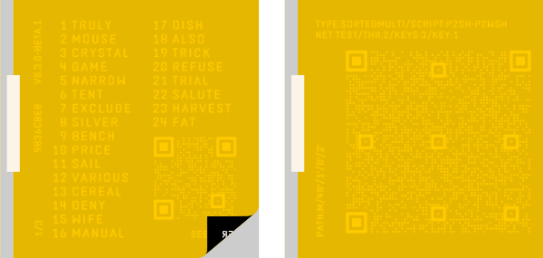
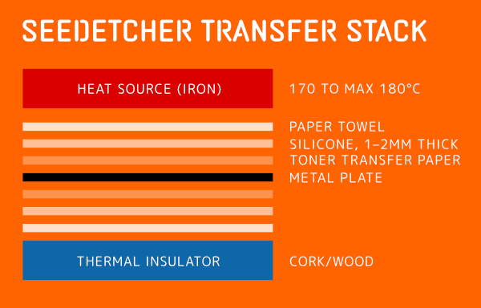

# SeedEtcher Workflow

A word of warning:\
This process is somewhat involved. It’s not a machine that you flip on and off and be done with it.\
But the idea was to create a process that doesn’t require a $500 machine. Most of the items you need you might already have. Also, you won’t create multisig backups very often. Besides, how about adding a new skill to your skill set: etching metal!
This workflow has many unknown variables (like the laser printer/toner (original or cheap replacement?) or iron you use). I tried to rule out as many variables as possible. With b0.3 the process got a lot more reliable. Still, your mileage may vary. Do not expect this to work on your first try.

Here's SeedEtcher's YouTube channel: https://www.youtube.com/@SeedEtcher \
A video DOES NOT REPLACE this guide. Please do read this guide for best results AND security/safety instructions.

## A Note on Metal

316L is the most corrosion resistant type of steel. So if you want maximum longevity, don't cheap out. 304 works too but it absolutely needs citric passivation. Citric passivation is also recommended for 316L but not as urgently. See notes on citric acid bath below (post processing).
Titanium doesn't etch well with FeCl3. Electro etching could be an option. Stay tuned. 
As for thickness: 1.5mm is the minimum. 2mm is substantial.

## What you need:

- [ ] Raspberry Pi Zero with screen and cam (same hardware as SeedSigner)
- [ ] micro SD-Card
- [ ] SeedEtcher Firmware
- [ ] Laser Printer (air gapped), I only tested Brother HL-L5000D, L2360DN and HL-L2400D so far. But all Brother printers should work. Printer needs to understand PCL or PS (not emulated!) or Host Based Printing (HBP). Avoid eco toners.
- [ ] Micro-USB male to USB-A female ([amazon](https://a.co/d/drLFF49))
- [ ] Steel Plates, 304/316L, 10x10cm (make sure they are really flat). You can get them on ebay or amazon or cut your own.
- [ ] Iron (for ironing clothes)
- [ ] 0.5-2mm thick silicone sheet ([amazon](https://a.co/d/2F59LSZ)) for SeedEtcher Transfer Stack, cut 2 pieces of 110x110mm.
- [ ] Wood board, cork mat (optional)
- [ ] Toner Transfer Paper ([amazon](https://a.co/d/dmR4RUL))
- [ ] Anti-etching pens ([amazon](https://a.co/d/5DnOhRR)), stop out ground e.g. from [Lascaux](https://lascaux.ch/en/products/brushes-printmaking-sets-various/lascaux-etching?shp3_product=1704) or [Charbonnel](https://intaglioprintmaker.com/product/charbonnel-lamour-black-covering-varnish/) or nail polish
- [ ] Packaging or electrical tape
- [ ] Masking tape
- [ ] Acetone
- [ ] Isopropyl Alcohol
- [ ] Ferric Chloride Etching 40% solution ([amazon](https://a.co/d/h497Xaa)), you can also find it in art supply stores, or on ebay.com\
If you can, get 30% solution, it's more efficient (viscosity). But you can create 30% from 40% solution by adding distilled water: [FeCl3-40to30.md](FeCl3-40to30.md)
Note: FeCl is for etching brass, copper and steel. It does not work for titanium! Etching titanium with hydrofluoric acid is not recommended unless you have a lab and know what you are doing.
- [ ] Nitrile Gloves, eye protection
- [ ] HDPE/PP etching container
- [ ] Container for water bath (40°C)
- [ ] Baking Soda (sodium bicarbonate, NaHCO₃), NOT baking powder (contains acids + starch)
- [ ] Citric acid 50-100g (aka citric acid powder, food grade citric acid, sour salt) [amazon](https://a.co/d/04FpymMQ)

Really nice to have:
- [ ] Thermometer
- [ ] Aquarium air pump
- [ ] Aquarium heater

## Flash SeedEtcher to SD-card

Use [balena etcher](https://etcher.balena.io) or via cmd line:

MacOS:

```bash 
diskutil unmountDisk /dev/diskX
sudo dd if=result/seedetcher.img of=/dev/rdiskX bs=1m
diskutil eject /dev/diskX
```

## Load Descriptor and Seedphrases

There are multiple ways of doing this and it is beyond the scope of this guide.\
SeedEtcher just needs a QR of the descriptor. The seedphrase(s) can be input via QR or manually.
You generally use a coordinator like [sparrow](https://www.sparrowwallet.com) to create the descriptor.
Note: Sparrow just needs the xpubs of the seedphrases for this and not the actual seedphrase(s).
Example: Create the 3 seedphrases for a 2/3 multisig on [SeedSigner](https://seedsigner.com). Use sparrow to create the descriptor.
Scan the descriptor from sparrow with SeedEtcher and then each seedphrase QR from the SeedSigner. Tip: use a magnifying glass in front of the SeedEtcher cam to scan the tiny dotted QR from the SeedSigner.

## Descriptor Shares

For multisig backups, SeedEtcher prints UR/XOR descriptor shares instead of a full descriptor on each plate for these multisig wallets configurations:
`1/2`, `2/2`, `2/3`, `2/4`, `4/4`, `3/5`, and any `n-1/n`. No single plate reveals the full descriptor.
For all other n/m variants we print the full descriptor.


### Backup flow (on device)

For multisig backups, the on-device review/setup flow is:

1. Confirm wallet (check receive/change addresses)
2. Fingerprints review (all cosigner fingerprints, paged)
3. Wallet label
4. Choose print settings
5. Print

## Printing the Layouts

Connect the dataport of the Pi Zero (it’s the one closer to the center) to the printer’s USB port. Connect a power source to the other port. SeedEtcher sends a bitmap via this USB connection using PCL, PostScript or HBP (Brother host based printers protocol).
Tip: Print the layout to paper first to check. You can set inverted and mirrored off for that to save toner.
For the real print remember to use inverted and mirrored!
Use the manual feed to print onto the transfer paper. Make sure it prints onto the glossy side!

### Printer Settings

- Set resolution to highest your printer supports (bitmap is sent at 1200dpi or 600dpi) (Caveat: Brother HQ1200 is not true 1200. If you send a 1200dpi bitmap to a printer set to HQ1200/600 via PCL, it will print it 200% in size. Just send 600dpi in that case.) HBP only supports 600dpi.
- Shut off toner saving options.
- If it has a silent mode option, turn it on (prints slower which is good).
- Set density to 0 (neutral, not +, not -).
- Configure manual feeder to be prioritized, makes it more convenient.

### A Note on Printing and Security

SeedEtcher is an air-gapped workflow. Therefore, your printer should obviously also be air-gapped. You should not use a networked printer for this. Albeit, it is very unlikely that an attacker would be able to extract the print layout, it is not impossible. So, keep that in mind. Some printers have a memory wipe option.
Also, no cameras should be present where you do this process. That includes cell phones.

## Transferring Laser Print to Steel Plate

***IMPORTANT:*** Do not touch the printed surface! Oils from your fingers will prevent the toner from sticking to the metal.

1) ### Sand and clean metal plates
Use a scotch brite, steel wool or 240–320 grit sand paper to thoroughly clean the plate. If you like the brushed metal look, sand it that way. Then thoroughly clean it with warm water and dish soap. Then clean it with acetone. Optionally, clean it with isopropyl alcohol after the acetone. Do not touch it after that. Oil on surface is your enemy. Let it dry.

2) ### Cut and fasten transfer paper to plates
Cut the plate layouts as indicated by the cut marks. Use a clean surface (fresh piece of paper on a cutting mat), a clean metal ruler and a sharp cutter.
The new layout is designed for maximal mask coverage of a 100x100mm plate. Put the transfer paper with the laser side down on the plate. Pay attention what side should be flush with the plate edge! The left side (when looking at the plate with the transfer paper laid down) is intentionally 5mm shorter so you can tape it down with a small strip of masking tape. (Tip: put a piece of tape on the cutting mat and cut it to thin strips of 5x20mm).



*If you sanded to a brushed look, the direction of the brushed lines are important. Light breaks differently on brushed metal depending on the direction they run in. If you hold a plate towards a light source, horizontal lines will diffuse the light and reflections, vertical lines will reflect more. So, the brushed lines should run horizontally to your plate layout. The QR code is easier to scan when looking normally at the plate. This is a detail but it is worth mentioning.*

1) ### SeedEtcher Transfer Stack
With the SeedEtcher Transfer Stack it is now possible to heat transfer both sides of the plate at once.



Pre-heat the iron to around 175°C. (the temperature has to be between 150°C and 180°C but no more than 180°C). Tip: Use a thermometer to figure out how hot your iron gets.
Put a paper towel folded 4 times on your wood board (optionally use cork, even better insulator). The board should be on the floor and it should not wiggle.
Put a silicone sheet, then the plate, another silicone sheet, then a 10x10cm piece of paper towel.
The silicone sheets distribute pressure and heat vastly better. You will regret it if you leave this out!

4) ### Heat Transfer
Set a timer to 180 seconds. Start the timer. Press the iron onto the plate with increasing pressure, covering the whole plate with the iron for 60s. Do not slide the iron!
Lift, press down on left half of plate, 30s. Then right side 30s. Then top 30s. Then bottom.
Pressure is important. Do it on the floor where you can really lean onto the iron. But be careful to not slide while pressing! And please, do not break your wife’s iron.

Optional: Put a stack of steel plates on top of the hot plate (heat sink).
Let it cool off completely! It will take a while (20m). The transfer paper should buckle and lift off the metal all by itself. The transfer paper should come off without any toner sticking to it. 

1) ### Bake plate in oven (don't skip this step)
Bake for 12 minutes at 180°C, no airflow.  
This reflows the toner and makes it stick even more to the plate and closes pinholes.
***IMPORTANT:*** With the new layout most of the plate is covered in toner mask to the edges. Use a baking tray, put two silicon sheets next to each other (they are heat resistant). Place a tee cup that is high enough to lean the plate against on one sheet. The silcone prevents the cup and plate from sliding. Put Bottom edge of the plate on the silicone and the lean the top edege against the cup.
Make the setup in cold oven.
Let this cool down when done baking and only then move it. If the plate falls while it's hot your toner mask is ruined.

1) ### Repairs
If the transfer wasn’t perfect you can do repairs by using nail polish or stop out ground and a small brush or anti-etching pens ([amazon](https://a.co/d/5DnOhRR))

### Transfer Troubleshooting
Don’t be frustrated if it doesn’t work the first time. This takes practice.
Common culprits: 
- not enough pressure (most of the toner sticks to the paper)
- not enough heat (most of the toner sticks to the paper)
- plate not clean enough (toner doesn’t stick everywhere)
- touching the print toner surface or plate (oils!)
- smeared transfer: your iron was too hot, or you moved/sheared the stack

## Etching

### You’ll need:

- [ ] Container to hold Ferric Chloride. Food containers made from HDPE/PP work well. NO METAL containers, obviously! Choose a size that allows to fully submerge the metal plate in 1 liter (or less) solution. Ideally the plate is vertical, especially when you want to etch both sides at the same time. Tip: Test with water first.\
I designed a 3d printed container for etching both sides holding exactly 0.5l of etchant. But I will not release the files just yet.
- [ ] Plastic container to hold a 40°C water bath. You put the etching container into it.
- [ ] Thermos with hot water to top up when the bath gets too cold
- [ ] Plastic bowl with 1L of 30–40°C warm water and 1–2 tablespoons (15–30 g) of baking soda (NaHCO₃) dissolved into it.
- [ ] Gloves and eye protection
- [ ] Timer
- [ ] Close access to running water

### Safety

Do work in a well ventilated area or outdoors. Albeit the fumes from FeCl3 aren't strong, I just recommend it.
Do wear protection gear: nitrile gloves, eye protection (important!). And maybe don't wear your favorite Bitcoin t-shirt.

***W A R N I N G***\
Ferric Chloride stains EVERYTHING it comes in contact with. Don’t let it drip into your kitchen sink, you’ll ruin the sink.
Neutralize everything with the baking soda water solution!

1. Prepare the plate. You have to mask off the unmasked strip on the left side. Make sure you mask it off properly or etchant will get to it. Normal packaging tape or electrical tape works. Avoid masking tape! (it’s not waterproof)\
Tip: make a holding flap from tape, so you can hold the plate easily from top.
2. Make sure the etchant is around 40°C. Tip: Put the etching container in a slightly warmer water bath to achieve the temperature. Use hot water from thermos to adjust it. Nice to have: Use an aquarium heater.
3. Set timer to 60 minutes. Submerge the plate fully into the FeCl, ideally keep it vertical. Get the FeCl moving slightly by either moving the container or the plate\
Etchant needs to be moving, or no fresh etchant will get to where it is supposed to. So, either take a plastic or glass stick and stir or use a fishtank air pump to produce bubbles from the bottom of the etch tank. If the bubbles are too strong, clamp the silicone tube slightly. This is a very comfortable setup.
4. Check the plate every 20 minutes. Check the mask. It is best not to do multiple sessions with neutralizing bath and water rinse, I found. It tends to destroy the mask.
60 minutes should get you 0.2mm etch depth. If the mask looks fine after 60 you can go futher. All this depends on how good your mask holds up.
5. When desired etch depth has been reached, take the plate out, let it drip off, submerge it into the baking soda bowl. This neutralises the acidic ferric-chloride residue.
6. Rinse the plate under running water.
Do not etch unattended, check on it every 20 minutes.

One liter of FeCl should last you for plenty of plates. I etched 16 plates and it still works fine.\
When etch times double: replace.
Note: The etchant solution does not expire, but it loses strength as iron salts build up. 
So, re-use the etchant and when it’s done dispose of it properly.

## A note on Electric Etching

You could use salt water and 12V/1amp to etch.\
However, I do strongly advise you NOT to do that. Etching stainless steel with salt water can produce chlorine gas and other toxic chlorine compounds.\
You do NOT want chlorine gas in your lungs. There are hundreds of YouTube videos on etching like this, and none of them cares to give you that warning.
Etching copper or brass this way is fine.
Using Na2SO4 seems the way to go. But I need to do more testing.

## Post processing

Remove the toner with a stainless steel scrubber with dish soap and running water. Super efficient!
Clean rest with acetone.

If you etch 304 steel, citric acid passivation is recommended to restore corrosion resistance.
For 316L, citric passivation is optional but still recommended for best long-term stability.
A vinegar wipe is better than nothing, but less effective than citric passivation.

### Citric passivation (quick recipe)

1. Mix a 5-10% citric acid solution (50-100 g citric acid per 1 L water) in a plastic or glass container.
2. Warm solution to about 50-60°C if possible.
3. Soak the plate for:
   - 20-30 minutes at 50-60°C, or
   - 60-120 minutes at room temperature.
4. Rinse thoroughly with clean water and dry completely.

***Safety:*** Citric acid is relatively low hazard, but it is still an acid. Avoid breathing powder dust, avoid eye contact, and wear gloves and eye protection. Never mix with bleach/chlorine cleaners.
Reuse/disposal: You can reuse the citric solution multiple times if it remains reasonably clean. Store it in a labeled HDPE/PP (PET is fine as well here) plastic bottle. Replace when performance drops or it becomes visibly contaminated. For disposal, follow local rules; heavily metal-contaminated solution should be treated as hazardous waste.

If the etching started to etch surfaces that should have been masked, you can often correct it by using 240-320 grit sandpaper with a sanding block.
Carefully sand the etched plate until the undesired etching errors are mostly gone.

Do not keep failed prints or transfer sheets: destroy immediately!

And lastly: Please do test your backup before calling it done.
