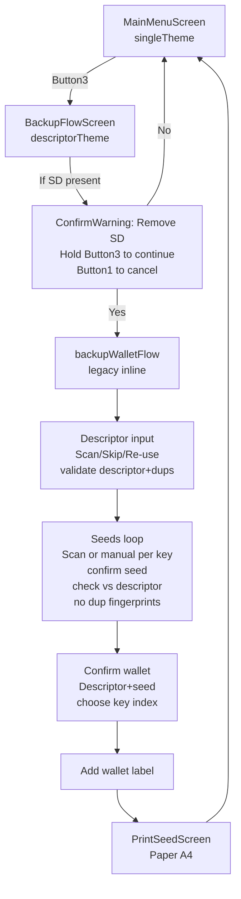

# GUI Flow (current)

Manual entry UX: if the seed is invalid or mismatched, the confirm screen leaves you on the same seed input with your entered words prefilled for correction (no restart).

Notes:
- `Run` enters the Screen state machine at `MainMenuScreen`.
- Colors: `singleTheme` on menu; `descriptorTheme` for backup flow and warnings.
- All helper logic lives alongside screens (`gui/screen_*.go` and `gui/screen_helpers.go`).

Planned refactor steps:
- Replace `backupWalletFlow` with explicit `Screen` structs: Descriptor input → Seed entry/confirm → Wallet confirm → Print.
- Keep testing on device via `nix run .#reload $USBDEV1` after each step.
