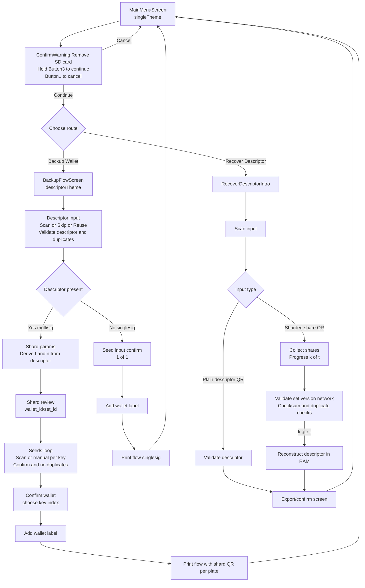

# GUI Flow (current)

Manual entry UX: if the seed is invalid or mismatched, the confirm screen leaves you on the same seed input with your entered words prefilled for correction (no restart).

Notes:
- `Run` enters the Screen state machine at `MainMenuScreen`.
- Colors: `singleTheme` on menu; `descriptorTheme` for backup flow and warnings.
- All helper logic lives alongside screens (`gui/screen_*.go` and `gui/screen_helpers.go`).
- Multisig backup uses sharded descriptor mode only in b0.2.
- Singlesig backup stays non-sharded.
- Recovery mode accepts both sharded shares and plain descriptor QR input.
- Plain descriptor QR input bypasses shard threshold accumulation and goes directly to export/confirm.
- Recovery QR screen copy:
  - Title: `Recovered Descriptor QR`
  - Body: `Scan with your coordinator, then choose:`
  - `Back = show QR again`
  - `Trash = delete and restart`

Implementation note:
- Active flow already uses explicit `Screen` structs (`MainMenuScreen` -> `BackupFlowScreen` stages).
- `backupWalletFlow` in `gui/screen_backup.go` is legacy/helper code and should not be expanded for new work.
- Keep testing on device via `nix run .#reload $USBDEV1` after each step.
