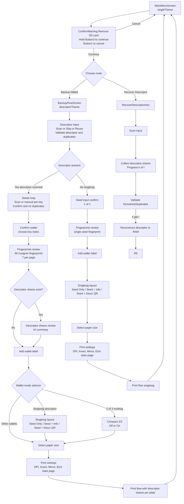

# GUI Flow (current)

Manual entry UX: if the seed is invalid or mismatched, the confirm screen leaves you on the same seed input with your entered words prefilled for correction (no restart).

Notes:
- `Run` enters the Screen state machine at `MainMenuScreen`.
- Colors: `singleTheme` on menu; `descriptorTheme` for backup flow and warnings.
- All helper logic lives alongside screens (`gui/screen_*.go` and `gui/screen_helpers.go`).
- Multisig backup uses sharded descriptor mode only since since v0.2.0-beta.1.
- Singlesig backup stays non-sharded.
- Backup review sequence for multisig is:
  - `Confirm wallet` -> `Fingerprints` -> optional `Descriptor shares` -> `Wallet label` -> wallet-mode selector (`Compact 2/3` when eligible, `Singlesig layout` for singlesig descriptor) -> `Paper size` -> print settings -> `Print`.
- Backup review sequence for singlesig (descriptor skipped) is:
  - `Seed input` -> `Fingerprints` -> `Wallet label` -> `Singlesig layout` -> `Paper size` -> print settings -> `Print`.
  - Back from `Fingerprints` opens `Restart Process?`; decline returns to `Fingerprints`.
- `Fingerprints` uses page navigation (left/right arrows) and keeps back/check nav buttons (`7` entries/page).
- In backup descriptor scan, UR/XOR 2-of-3 fragments show `x/2` capture progress (not `%`).
- Print setup order is wallet-mode selector (if applicable) -> `Paper size` -> `DPI` -> `Invert` -> `Mirror` -> `Etch stats page`.
- When `Etch stats page` is enabled, one additional stats page is appended after plate pages:
  - area/coverage table per printed plate side (`mm²` and `%`),
  - per-plate PSU current guide (`Set A masked` / `Set A unmasked`) using bench defaults.
- Recovery mode is descriptor-share recovery; plain descriptor QR input is rejected with an explicit message.
- Recovery QR screen copy:
  - Title: `Recovered Descriptor QR`
  - Body: `Scan with your coordinator, then choose:`
  - `Back = show QR again`
  - `Trash = delete and restart`

Implementation note:
- Active flow uses explicit `Screen` structs (`MainMenuScreen` -> `BackupFlowScreen` stages).
- Keep testing on device via `nix run .#reload $USBDEV1` after each step.
